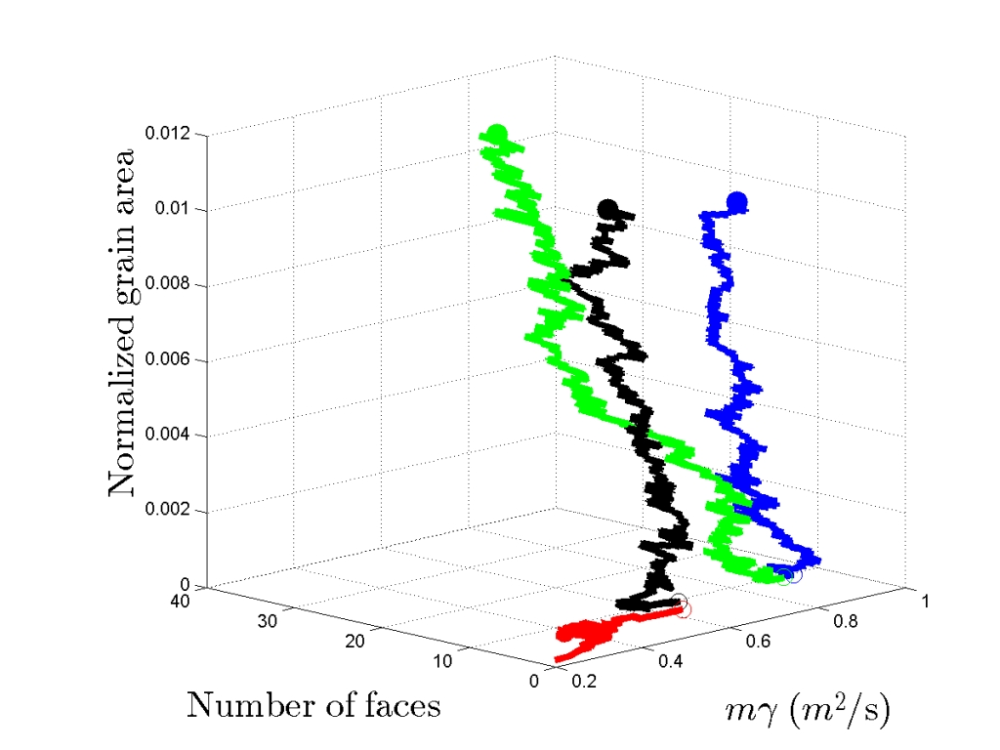

.. Documentation to the TopologyTracer
.. ===================================

TopologyTracer is a postprocessing tool for the identification of structural changes in the topology, the properties of grains, and their neighbors from grain growth simulation data conducted in synthetic polycrystals. 
The source is developed by Markus Kuhbach at the Institute of Physical Metallurgy and Metal Physics.

 .. figure:: ../images/IMMLogo.png
   :scale: 50%
   :align: center

1. Getting started
^^^^^^^^^^^^^^^^^^

The compilation of TopologyTracer utilizes standard Linux tools.

.. toctree::
   :maxdepth: 2
     
   setup
   

2. Creating input
^^^^^^^^^^^^^^^^^

 .. figure:: ../images/SCubeBiProtrusions.jpg
   :scale: 40%
   :align: center   
   
   
.. toctree::
   :maxdepth: 2
      
   simulate
   input
   

3. Tracing grains
^^^^^^^^^^^^^^^^^

By default it is assumed that the executable is placed in the same folder as the raw data. Then, **tracing**, i.e. the process of postprocessing time-resolved data with TopologyTracer is invoked with the following command line call::

   mpiexec -n <proc> topologytracer <1> <2> <3> <4> <5> <6>
   
In its current version the following six input arguments are necessary:
 | <proc> **HowManyProcesses**
 | <1> **JobID** a positive integer to distinguish the simulation output from other data
 | <2> **N0** the number of grains found in total in the earliest time step. It is assumed that upon grain growth the number of grains shrinks.
 | <3> **<First>** ID of the first snapshot that should be considered, positive integer
 | <4> **<Offset>** how many simulation steps are the snapshots apart, positive integer
 | <5> **<Last>** ID of the last snapshot that should be considered, positive integer
 | <6> **<MemoryPerProcess>** how much physical memory is guaranteed to be safely written to per process, in MB

During reading GraGLeS2D input data the TopologyTracer automatically determines the file size to plan how many snapshots that are consecutive in simulation time can be loaded into a single process. This improves data locality.
However, this requires a smart choice of the <6> argument. Exemplarily, imagine 1000 snapshots with 50 GB in total should be processed. Now, if 10 nodes are commissioned to this task, setting <6> to 10 GB would result in the first node collecting as many snapshot datas until its memory is filled to 10 GB, then the second process does the same, ..., resulting in only probably 5 nodes getting to work, while the others idle.
On the other hand the number of process should not exceed the number of physical devices onto which the snapshot are stored as this would quickly congest physically the media servers. Assume congestion is insignificant up to 10 parallel streams.
Then, the 1000 snapshots should be spread on 10 processes each hosting approximately 5 GB.

.. toctree::
   :maxdepth: 2
   
   tracing
   
   
4. Visualizing results
^^^^^^^^^^^^^^^^^^^^^^

In its current state the TopologyTracer does not contain a GUI yet. Instead, plain MPI I/O raw files are being generated and postprocessed with the MATLAB scripts available in the *scripts* folder.

   
  

References
^^^^^^^^^^

For the method itself:
 | Kuhbach M., Barrales-Mora L.A., Miessen C., Gottstein G.: 
 | **Ultrafast analysis of individual grain behavior during grain growth by parallel computing** 
 | Proceedings of the 36th Riso International Symposium on Materials Science 
 | doi:10.1088/1757-899X/89/1/012031

Specifically about GraGLeS:
 | Miessen C., Liesenjohann M., Barrales-Mora L.A., Shvindlerman L.S., Gottstein G.
 | An advanced level set approach to grain growth – Accounting for grain boundary anisotropy and finite triple junction mobility
 | Acta Materialia, 2015, 99
 | doi:10.1016/j.actamat.2015.07.040
 
 
Funding:
 | The authors gratefully acknowledge the support from the DFG in the frame of the Reinhart Kosselleck project (GO 3356/44-1).
 | Furthermore, we acknowledge the support from the FZJuelich and RWTH Aachen University within the project JARAHPC projects. 
 
 
Version history
^^^^^^^^^^^^^^^

 | **v0.1** first set of functionalities to obtain temporal trajectories in topology/mobility/energy phase space, simple neighbor correlations and disorientation

   
Licence
^^^^^^^

The project is licenced under the GNU v2.0

.. Indices and tables
.. ==================

.. * :ref:`genindex`
.. * :ref:`modindex`
.. * :ref:`search`

Questions, contributions
^^^^^^^^^^^^^^^^^^^^^^^^

Just let me know or contact *markus.kuehbach@rwth-aachen.de*