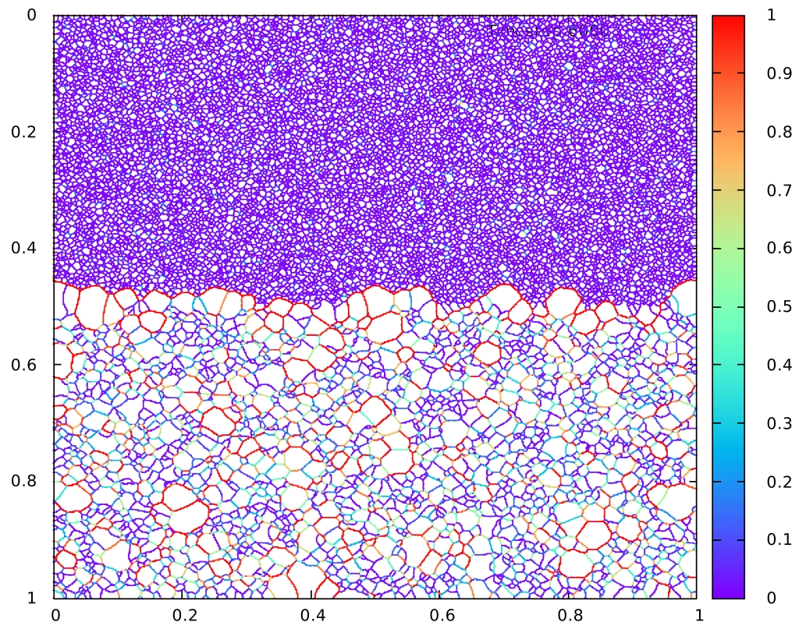

.. Documentation to the GraGLeS 2d Project
.. ===================================

The Grain Growth Level Set simulation tool is a 2D evolution solver for arbitrary tesselations. The evolution can be discribed by a gradient flow - in the shown apllication we implemented a weighted mean curvature flow. This models the well-known physical phenomena of grain growth in polycrystalline materials. We also hand out a suited post analysis tools to depict the topological transformation of the evolution. See 

https://github.com/mkuehbach/TopologyTracer

for further details. The GraGLes project is developed by Christian Mießen and Nikola Velinov at the Institute of Physical Metallurgy and Metal Physics.

 .. figure:: ../images/IMMLogo.png
   :scale: 50%
   :align: center

1. Getting started
^^^^^^^^^^^^^^^^^^

The compilation of GraGLeS2D utilizes standard Linux tools.

.. toctree::
   :maxdepth: 2
     
   setup
   

1. Installation Guide
^^^^^^^^^^^^^^^^^

2. Visualizing results
^^^^^^^^^^^^^^^^^^^^^^

#scripts
These shell scripts help to visualize the output. You basically need gnuplot to run these postprocessing scripts.

#plotNetworkAtTime.sh

execute: sh plotNetworkAtTime.sh timestep

The script will draw the polycrystal at time "timestep". 
"timestep" has to be a multiple of the "Analysisstep" defined in the parameters.xml.

#produceAnimation_aux.sh

execute: sh plotNetworkAtTime.sh analysisstep

The script will draw the evolution of the polycrystal by composing a gif file. 
"analysisstep" has to be a multiple of the "Analysisstep" defined in the parameters.xml.

   :scale: 40%
   :align: center
   
  

References
^^^^^^^^^^

Specifically about GraGLeS:
 | Miessen C., Liesenjohann M., Barrales-Mora L.A., Shvindlerman L.S., Gottstein G.
 | An advanced level set approach to grain growth – Accounting for grain boundary anisotropy and finite triple junction mobility
 | Acta Materialia, 2015, 99
 | doi:10.1016/j.actamat.2015.07.040
 
For the method itself:
 | Kuhbach M., Barrales-Mora L.A., Miessen C., Gottstein G.: 
 | **Ultrafast analysis of individual grain behavior during grain growth by parallel computing** 
 | Proceedings of the 36th Riso International Symposium on Materials Science 
 | doi:10.1088/1757-899X/89/1/012031
 
Funding:
 | The authors gratefully acknowledge the support from the DFG in the frame of the Reinhart Kosselleck project (GO 3356/44-1).
 | Furthermore, we acknowledge the support from the FZJuelich and RWTH Aachen University within the project JARAHPC projects. 
 
 
Version history
^^^^^^^^^^^^^^^

 | **v0.1** 

   
Licence
^^^^^^^

The project is licenced under the GNU v2.0

.. Indices and tables
.. ==================

.. * :ref:`genindex`
.. * :ref:`modindex`
.. * :ref:`search`

Questions, contributions
^^^^^^^^^^^^^^^^^^^^^^^^

Just let me know or contact *miessen@imm.rwth-aachen.de*
